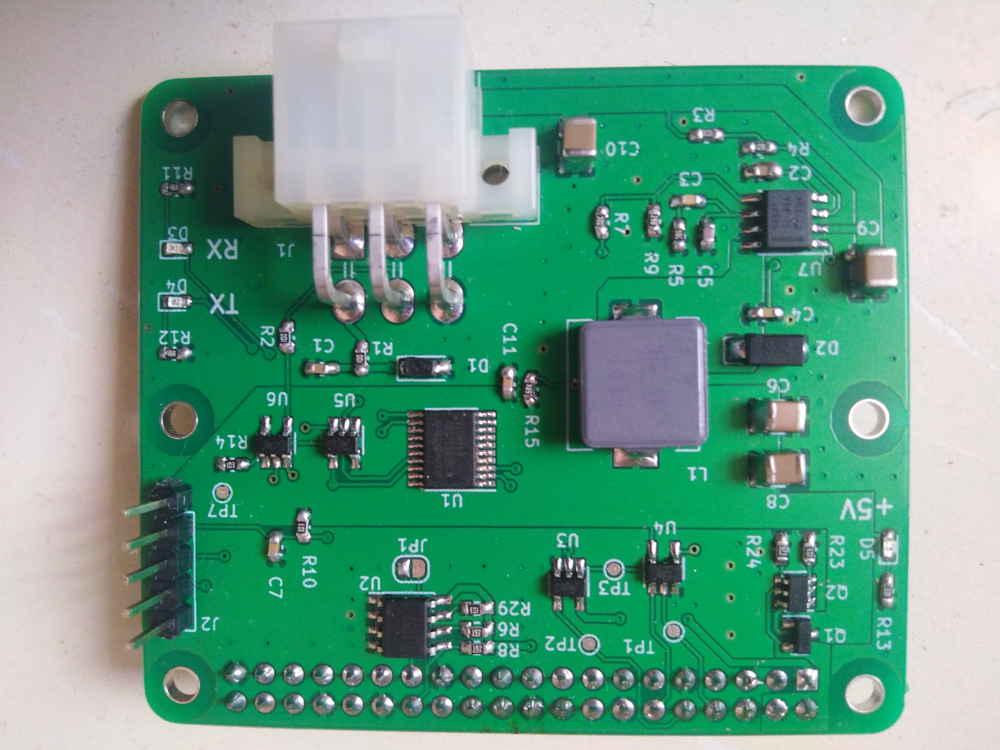
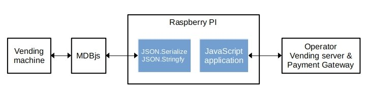
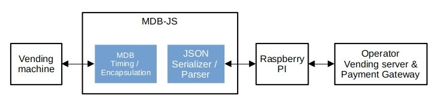

Easy build Internet Connected vending machines retrofit.

### Introduction

MDB-JS is an Open-Source board for converting MDB/ICP protocol to JSON objects. it enables web and mobile application developers to manage Protocol transactions data and sniffing using JSON objects.

MDB-JS board allows developers to :

* Build vending cloud / mobile applications using **web technology** ( JavaScript, python, PHP, etc.)
* **No prior experience** in embedded electronics or MDB/ICP protocol 
* **Easy Integration** with any existing vending mobile application or vending machine management cloud.
* Easy Creation of **RESTfull**  Vending management system API interfaces.
* Use any host main board ( e.g. RaspberryPI, ESP32,ESP8266, OrangePI, Pine64, etc… ) 


### Create Unique value for vending operators

By building web / mobile application based on MDB-JS board you will offer these value to operators :

* Access, update and remotely manage vending machines from anywhere. 
* update almost anything, from the digital signage videos, pricing, images and sounds.
* get full reporting on the sales and inventory health.
* integrate Apple Pay™, Samsung Pay™, Google Wallet™ etc
* Remote MDB traffic logging for sales and payments documentation 
* instant Cash and product levels tracking. 
* MDB protocol sniffer to find problems and errors.
* Exchange  EVA-DTS, MDB, ccTalk, DEX with Vending Controller
* **open source** allow for building customized system from ground up.
* **Custom integration** of web application to fit any existing vending management software system  
* **secure system** by keeping sales data on operator servers.
* **reduce monthly expenses**  no vending management software or cloud is required 
* **low setup cost** : solution hardware price is far cheaper than competitors 

 <span style="color: red;">**All features above can be created using JavaScript only or any Language of your choice.**</span>

### Vending Application Use cases:

1. _mobile payment application_: for e-Wallet based payment from mobile phone

2. _remote vending application_ :  to allow user to select purchasing item from phone screen 

3. _Remote Telemetry for :_ 
   
   * sniffing the protocol to debug machine protocol transactions 
   
   * logging for sales reports and inventory and routing management 

4. _communication device :_
   
   * update price list
   * update screen content


### Features

* Compatible raspberry-pi HAT form-factor
* 25W power supply to power most raspberry PI boards up to RPI 4
* 5V to 24V input supply range at 5A.
* MDB v4.3 protocol compatible
* Level shift to 3.3V to match raspberry PI pin level. 
* Comunications Ports : UART / SPI / I2C
* Data Exchange format: JSON


### How it Works

MDB-JS manages to shift all embedded development into JavaScript (or any web programming language ). as shown in next figure the Raspberry PI is used to implement vending peripheral function. In which  Raspberry PI has to serialize and parse JSON objects only in order to interact with MDB bus. 




Inside MDB-JS board’s micro-controller firmware, JSON serializer parser and JSON-to-string converter is implemented to interact with host board (e.g. raspberry PI)



MDB bus is fully handled in firmware so no need to take of protocol timing, data format, or response format.  which means MDB-JS board only exchange necessary data with host board (e.g. raspberry PI).


### Remote vending and mobile payment use case

In this section we discuss an implementation of remote vending and mobile payment protocol transactions and JSON object to Raspberry PI exchange. in this example Raspberry PI is only involved into FOUR transaction as follows:

1. The user selects an item to purchase on his/her mobile screen: Raspberry PI creates JSON object accordingly and send to MDB-JS board 
2. MDB-JS then responds to VMC POLL command by the Item _selection-request_. Then it wait for _vend-request_ command from VMC and forward it to Raspberry PI in JSON format. Transparently from Host-board (e.g. Raspberry PI)
3. Next JavaScript code handles communication with the payment gateway and checks for available funds in customer e-Wallet. then send JSON object contain _vend-approved_ reply.
4. MDB-JS then handles mdb protocol responses and send back _vend-success_ to raspberry PI


__Note :__   _only transactions in RED color arrows are transfered between  raspberry PI and MDB-JS_


**Step <span style="color: red;">( 1 )</span>**

JSON object is created in JavaScript to include _Selection-request_ with parameters { available funds = 10$ , Item number=12, Payment media type = “normal”, Payment media id = “0”, payment media accepts refund=“No”, Payment data = “0”, }. Raspberry PI then converts JSON to a string array and send over serial-port to the MDB-JS board.

```json
{
 "mdb": {
 "cmd": "selection",
 "subcmd": "request",
     "data": {
         "funds": "10",
         "pymntmediaID": "0",
         "pymntmediaType": "norm",
         "pymntdata": "0",
         "item-num": "12",
         "pymnt-opt": "norefund"
         }
     }
}
```


**Step <span style="color: red;">( 2 )</span>**

Next VMC sends _vend-request_ with these parameters { item price=1$,  item number = 12, item count = 1} . MDB-JS creates a JSON object accordingly and send to Raspberry PI

```json
{
    "mdb": {
        "cmd": "vend",
        "subcmd": "req"
    },
    "data": {
        "item-price": "1",
        "item-num": "12",
        "item-count": "1"
    }
}
```


**Step <span style="color: red;">( 3 )</span>**

Raspberry PI send a JSON object to indicate that requested funds ($1) is available an the vend request is approved.

```json
{
    "mdb": {
        "cmd": "vend",
        "subcmd": "approvd"
    },
    "data": {
        "amount": "1"
    }
}
```


**Step <span style="color: red;">( 4 )</span>**

finally MDB-JS indicates that the operation is compeleted successfully and send JSON object to the Raspberry PI accordingly 

```json
{
    "mdb": {
        "cmd": "session",
        "subcmd": "cmplt"
    }
}
```
